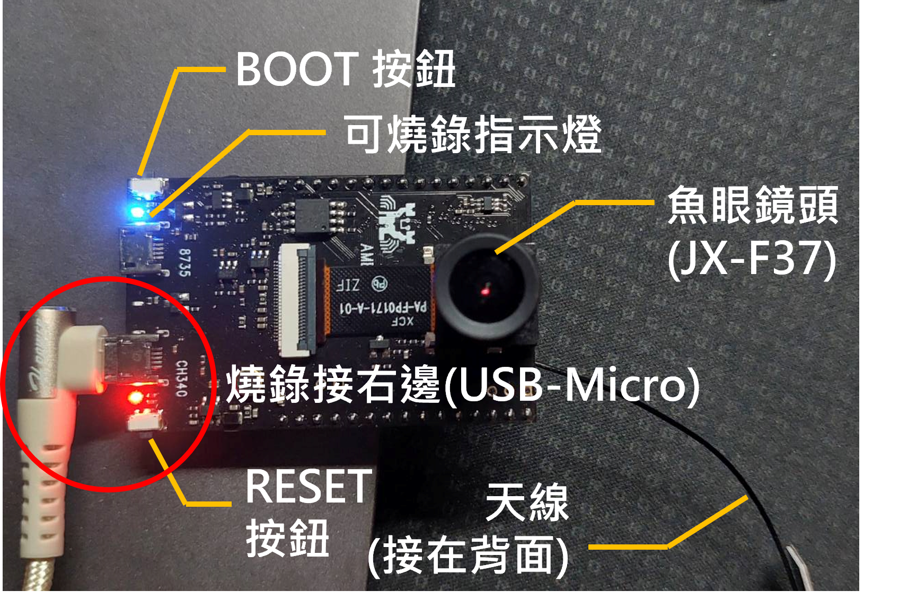

# AmebaCam: A Real-Time Embedded Camera Streaming and Capture Platform

[English](README.md)

本專案旨在透過一台中央伺服器與最多 12 組 AMB82-MINI 開發板建立通訊管道，並以 RTSP 串流方式擷取每塊板載攝影機的即時畫面。系統內建圖片儲存功能，依據攝影機 IP 分別存放圖片，並提供 frame callback 範例，讓使用者能針對每張圖片執行額外處理。

## 實驗影片

**[Watch on YouTube](https://youtu.be/PGFpv_XXGeo)**

https://github.com/user-attachments/assets/8ebd3582-642d-42e5-9c9c-998134e5b559

## 環境要求

### Python

- cv2 (opencv-python) @4.11.0.86
- zeroconf @0.146.1

可以透過以下命令安裝:

```bash
pip install opencv-python==4.11.0.86
pip install zeroconf==0.146.1
```

### Arduino IDE

- [Download Arduino IDE](https://www.arduino.cc/en/software/)
- [Install Ameba82 plugin](https://www.amebaiot.com/zh/amebapro2-amb82-mini-arduino-getting-started/)

## 專案架構

- `RTSP.ino`: AMB82-MINI 的韌體，可用 Arduino IDE 或是 VSCode 中的 Arduino Community Edition 燒錄，燒錄順序請見[燒錄說明](#燒錄說明)
- `python/v1/main.py`: Server 的主程式，裡面有參數可以進行調整。Server 開啟時，也會在內網啟動名為 `ic-ameba.local` 的 mDNS 服務，AMB82-MINI 會尋找該網域並獲得 Server 的 IP，可以動態獲得目前的 Server IP。可以調整的參數如下:

  - `SHOW_STREAM`: True/False, 是否開啟 CV2 查看相機的 RTSP 串流，開啟時，每台相機會以獨立進程打開 CV 畫面顯示 RTSP Video。**當 CPU 占用過高應關閉**。
  - `SAVE_PICTURE`: True/False, 是否儲存圖片
  - `SAVE_EVERY_N_FRAME`: 每 n 張 frame 擷取一張圖片，預設 15，即每 15 frames 擷取一張圖片，目前 RTSP 的 FPS 為 30，所以每秒約擷取兩張圖片，設定過低將導致畫面延遲

  該程式可以透過 `conda activate base` + `python python/v1/main.py` 執行，前提是要以 `VSCode 以 File-> Open Folder -> C:\develop\cam4silicon\ameba82\firmware\RTSP` 打開，可以用 Terminal 輸入 pwd 檢查是否目前開啟路徑是否正確:

  ```bash
  pwd

  # 應該要顯示
  Path
  ----
  # if you cloned to your laptop
  <Your-Path-To-This-Repo>\ameba_stream_project
  # if you're using current developing laptop
  e.g., C:\develop\cam4silicon\ameba82\firmware\RTSP
  ```

  如果要結束 Server，請在指令行(terminal) 按下 `Crtl+C`

- `python-test`: 測試程式
- `data`: 儲存如數據、說明用圖片等資料
- `img`: 當 `SAVE_PICTURE` 為 `True` 時，儲存的圖片會以 Camera IP 作為資料夾名稱，當前畫面的 frame id 當作圖片名稱，以 `.jpg` 形式儲存在本資料夾中

## 燒錄說明

1. 須將 micro USB 線 A 側接上電腦，另一端接在 AMB82-MINI 標有 CH340 側(燒錄用)
2. 燒錄前，由於 AMB82-MINI 不具備自動進入燒錄模式的功能，因此需用按鈕使其進入燒錄模式
   按鈕順序為:

   - 先按 8735 側按鈕(BOOT 按鈕)，不要鬆開
   - 再按 CH340 側按鈕 (RESET 按鈕)，不要鬆開
   - 鬆開 CH340 側按鈕
   - 鬆開 8735 側按鈕

   當 AMB82-MINI 的藍色 LED 逐漸變亮時，即可開始燒錄，如下圖:

   

## Version

- `v1.2 stable`: 是目前主要的使用版本，僅針對三台使用 JX-FP37(P) 相機的 AMB82-MINI 進行過實驗，實驗結果如[實驗影片](#實驗影片)
- `v2`: 規劃中

## 注意事項

1. AMB82-MINI 需要**安裝天線**才能上網，可接收 2.4G/5G 頻段!!
2. 更新 Wi-Fi Access Point 需要重新燒錄，將 SSID, PASSWORD macro 更新(OTA 功能尚未實現)
3. 目前版本僅對 3 台 AMB82-MINI 在 AP、手機熱點上進行過實驗，12 台 Camera 需要再行確認
4. 請避免使用已經被很多電腦連接的 AP 當作 Wi-Fi access point，盡量使用沒有人使用的 Wi-Fi 或手機熱點
5. 使用手機熱點時請盡量避免觀看 youtube 等需要數據流量的動作，避免數據雍塞
6. **手機熱點的最大數量似乎只能到 10 台 Device(看手機和廠牌)，扣掉一台 Server 最多能連接 9 台 Camera**
7. 未來需要找 USB 集線器為 AMB82-MINI 群提供足夠的電源，電腦沒有那麼多 USB 接口!
8. 每次執行前，最好將儲存的圖片移動或刪除，避免不同次測試的圖片混在一起
